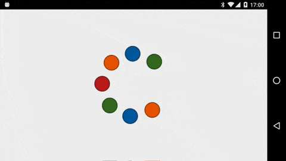

# Animate Me

This codelab will teach you how to use the Web Animations API to animate a few visual elements (colored dots). You'll just learn about the `Element.animate` method. This is the core of the Web Animations API, and is provided by the [`Animatable`](http://w3c.github.io/web-animations/#the-animatable-interface) interface.

The final version will run on both desktop and mobile, in all modern browsers. Check out this preview-

## Introduction

Before we start, let's quickly perform some introduction steps.

### Get the sample code

You'll need to get a copy of the source code - for more information, head to [the GitHub repository](https://github.com/web-animations/web-animations-codelabs). In this codelab, we'll just use the `animateme` folder.

### Open the sample site

Take a look at the demo we're going to enhance, by opening the `animateme/start/index.html` file. We just have a single dot at the center of the screen.

## Next Step

**Head on over to [Step 1: Include Web Animations &raquo;](step1.md)**